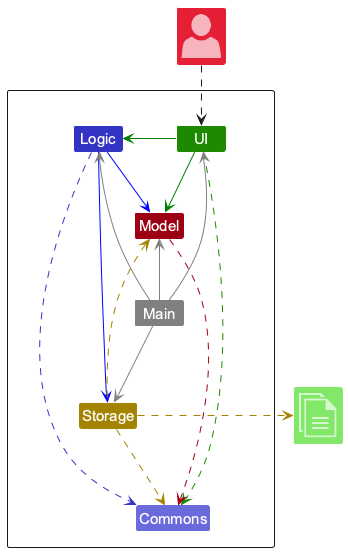
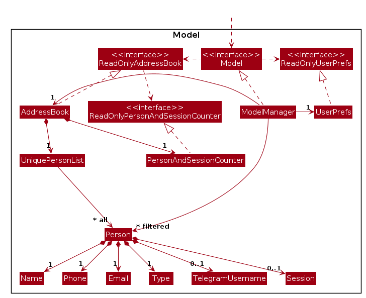
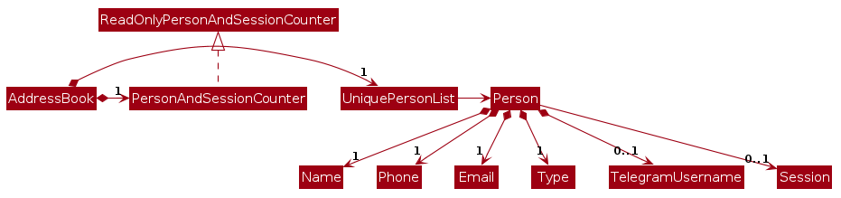

## Table of Contents
- [Acknowledgements](#acknowledgements)
- [Setting up, getting started](#setting-up-getting-started)
- [Design](#design)
- [Implementation](#implementation)
- [Documentation, logging, testing, configuration, dev-ops](#documentation-logging-testing-configuration-dev-ops)
- [Appendix: Requirements](#appendix-requirements)

--------------------------------------------------------------------------------------------------------------------

## **Acknowledgements**

- Application based on [SE-EDU AB3](https://github.com/se-edu/addressbook-level3)

--------------------------------------------------------------------------------------------------------------------

## **Setting up, getting started**

Refer to the guide [_Setting up and getting started_](SettingUp.md).

--------------------------------------------------------------------------------------------------------------------

## **Design**

:bulb: **Tip:** The `.puml` files used to create diagrams are in this document `docs/diagrams` folder. Refer to the [_PlantUML Tutorial_ at se-edu/guides](https://se-education.org/guides/tutorials/plantUml.html) to learn how to create and edit diagrams.

### Architecture

The ***Architecture Diagram*** given above explains the high-level design of the App.

Given below is a quick overview of main components and how they interact with each other.

**Main components of the architecture**

**`Main`** (consisting of classes [`Main`](https://github.com/AY2526S1-CS2103T-F15a-1/tp/tree/master/src/main/java/seedu/address/Main.java) and [`MainApp`](https://github.com/AY2526S1-CS2103T-F15a-1/tp/tree/master/src/main/java/seedu/address/MainApp.java)) is in charge of the app launch and shut down.
* At app launch, it initializes the other components in the correct sequence, and connects them up with each other.
* At shut down, it shuts down the other components and invokes cleanup methods where necessary.

The bulk of the app's work is done by the following four components:

* [**`UI`**](#ui-component): The UI of the App.
* [**`Logic`**](#logic-component): The command executor.
* [**`Model`**](#model-component): Holds the data of the App in memory.
* [**`Storage`**](#storage-component): Reads data from, and writes data to, the hard disk.

[**`Commons`**](#common-classes) represents a collection of classes used by multiple other components.

**How the architecture components interact with each other**

The *Sequence Diagram* below shows how the components interact with each other for the scenario where the user issues the command `delete 1`.

Each of the four main components (also shown in the diagram above),

* defines its *API* in an `interface` with the same name as the Component.
* implements its functionality using a concrete `{Component Name}Manager` class (which follows the corresponding API `interface` mentioned in the previous point.

For example, the `Logic` component defines its API in the `Logic.java` interface and implements its functionality using the `LogicManager.java` class which follows the `Logic` interface. Other components interact with a given component through its interface rather than the concrete class (reason: to prevent outside component's being coupled to the implementation of a component), as illustrated in the (partial) class diagram below.

The sections below give more details of each component.

### Data Validation Rules

To keep inputs clean and predictable, the Model enforces the following field constraints:

- Phone (Singapore): exactly 8 digits (0–9). Implemented via `\d{8}` in `seedu.address.model.person.Phone`.
- Name: ASCII letters only (a–z, A–Z; no digits), spaces, apostrophes (' U+0027, ‘ U+2018, ’ U+2019, ʼ U+02BC), hyphens (-), periods (.), slashes (/).
  Enforced by regex in `seedu.address.model.person.Name` with a maximum length of 500.
- Email: `local-part@domain` with pragmatic checks:
  - exactly one '@', no spaces
  - total length ≤ 254; local-part ≤ 64; each domain label ≤ 63
  - local-part: alphanumerics with [._+-] separators; cannot start/end with a separator; no consecutive dots
  - domain: contains at least one '.', labels separated by '.', each starts/ends alphanumeric; hyphens are allowed inside non-final labels (e.g., `exa-mple.com`), but the final label (Top Level Domain, TLD) must be alphanumeric only (so `co-m` is invalid); final label ≥ 2 characters
  - domain is case-insensitive and normalized to lowercase on storage

- Session: 1–2 uppercase letters, followed by a number from 1–99 (leading zero allowed for 1–9),
  and an optional trailing uppercase letter.
    - The format aligns with standard NUS module session naming conventions (e.g., `T07`, `T07B`, `F01`, `G1`, `WD12B`).
    - Invalid inputs (e.g., `G00`, `BA100`, lowercase variants) trigger
      `MESSAGE_INVALID_SESSION_FORMAT` with corrective examples.
    - Note that `G01` and `G1` are treated as different sessions; users should consistently use one format (with or without leading zeros) to avoid confusion.

- Type: Type must be one of the four inputs, **case-insensitive**: `student`, `ta`, `instructor`, and `staff`. eg. `StUdEnT` is allowed.
    - Type `student` and `ta` must have a session, and type `instructor` and `staff` should not have any session.

- Telegram Username: Optional field, must adhere to:
  - 5 to 32 characters long
  - accepted characters: a-z, A-Z, 0-9 and underscores
  - optionally, include @ as the first character (if you omit it, TAConnect prefixes one automatically)
  - for more details, see the following: https://core.telegram.org/method/account.updateUsername#parameters

See `seedu.address.model.person.Email` and `Phone` for the regex and checks. Parser utilities delegate to these validators.
The `find` command accepts keywords using the same (ASCII‑only) character set as `Name` and rejects digits, Unicode letters, or other symbols.

### UI component

The **API** of this component is specified in [`Ui.java`](https://github.com/AY2526S1-CS2103T-F15a-1/tp/tree/master/src/main/java/seedu/address/ui/Ui.java)

The UI consists of a `MainWindow` that is made up of parts e.g.`CommandBox`, `ResultDisplay`, `PersonListPanel`, `StatusBarFooter` etc. All these, including the `MainWindow`, inherit from the abstract `UiPart` class which captures the commonalities between classes that represent parts of the visible GUI.

The `UI` component uses the JavaFx UI framework. The layout of these UI parts are defined in matching `.fxml` files that are in the `src/main/resources/view` folder. For example, the layout of the [`MainWindow`](https://github.com/AY2526S1-CS2103T-F15a-1/tp/tree/master/src/main/java/seedu/address/ui/MainWindow.java) is specified in [`MainWindow.fxml`](https://github.com/AY2526S1-CS2103T-F15a-1/tp/tree/master/src/main/resources/view/MainWindow.fxml)

The `UI` component,

* executes user commands using the `Logic` component.
* listens for changes to `Model` data so that the UI can be updated with the modified data.
* keeps a reference to the `Logic` component, because the `UI` relies on the `Logic` to execute commands.
* depends on some classes in the `Model` component, as it displays `Person` object residing in the `Model`.

#### Command history semantics

- The command history is a linear list of previously **entered** commands.
- The history cursor ranges over all previously entered commands plus one special **latest position** that represents the current empty input.
- **Latest position (draft):**
    - When the tutor navigates away from latest, TAConnect saves the current input text as a **draft**.
    - Navigating **Down** back to latest **restores the draft** exactly as it was before history navigation began.
    - Edits made while viewing a recalled command **do not** overwrite the draft.
    - After returning to latest, any new edits update the input normally; if the tutor navigates again, the updated text becomes the new draft.

- **Navigation:**
    - **Up** moves from latest → most recent command → … → oldest command (stops at oldest).
    - **Down** moves toward newer commands and finally back to **latest**; at latest the **draft** is shown.

- **History lifecycle**

    - The history and cursor are **in-memory** and **not persisted** to disk; they reset on app restart.
    - The **draft** is scoped to the **latest position** and is not saved to storage.

- **History recording rules**

    - When the tutor presses **Enter**, if the input contains any non-whitespace characters, the **exact text** is appended to history **before** parsing/execution.
    - Therefore, **both successful and failed** commands are recorded.
    - Inputs that are empty or whitespace-only are **not** recorded.

- **Key bindings (UI mapping)**

    - `Up Arrow` → “Recall previous” (move cursor older by 1).
    - `Down Arrow` → “Next newer / latest (draft)” (move cursor newer by 1; at latest, show draft).

- **Edge cases**

    - If the tutor modifies the recalled command text **without executing**, those edits are **discarded** upon any navigation; the draft remains as originally captured at latest.
    - Any **non-blank** command is recorded in history (even if parsing/execution fails). Whitespace-only inputs are not recorded.

- *Related use cases: UC7, UC8, UC9.*

### Logic component

**API** : [`Logic.java`](https://github.com/AY2526S1-CS2103T-F15a-1/tp/tree/master/src/main/java/seedu/address/logic/Logic.java)

Here's a (partial) class diagram of the `Logic` component:

The sequence diagram below illustrates the interactions within the `Logic` component, taking `execute("delete 1")` API call as an example.

:information_source: **Note:** The lifeline for `DeleteCommandParser` should end at the destroy marker (X) but due to a limitation of PlantUML, the lifeline continues till the end of diagram.

How the `Logic` component works:

1. When `Logic` is called upon to execute a command, it is passed to an `AddressBookParser` object which in turn creates a parser that matches the command (e.g., `DeleteCommandParser`) and uses it to parse the command.
1. This results in a `Command` object (more precisely, an object of one of its subclasses e.g., `DeleteCommand`) which is executed by the `LogicManager`.
1. The command can communicate with the `Model` when it is executed (e.g. to delete a person). 
   Note that although this is shown as a single step in the diagram above (for simplicity), in the code it can take several interactions (between the command object and the `Model`) to achieve.
1. The result of the command execution is encapsulated as a `CommandResult` object which is returned back from `Logic`.

Here are the other classes in `Logic` (omitted from the class diagram above) that are used for parsing a user command:

How the parsing works:
* When called upon to parse a user command, the `AddressBookParser` class creates an `XYZCommandParser` (`XYZ` is a placeholder for the specific command name e.g., `AddCommandParser`) which uses the other classes shown above to parse the user command and create a `XYZCommand` object (e.g., `AddCommand`) which the `AddressBookParser` returns back as a `Command` object.
* All `XYZCommandParser` classes (e.g., `AddCommandParser`, `DeleteCommandParser`, ...) inherit from the `Parser` interface so that they can be treated similarly where possible e.g, during testing.

### Model component
**API** : [`Model.java`](https://github.com/AY2526S1-CS2103T-F15a-1/tp/tree/master/src/main/java/seedu/address/model/Model.java)

The `Model` component,

* stores the address book data i.e., all `Person` objects (which are contained in a `UniquePersonList` object).
* stores the currently 'selected' `Person` objects (e.g., results of a search query) as a separate _filtered_ list which is exposed to outsiders as an unmodifiable `ObservableList<Person>` that can be 'observed' e.g. the UI can be bound to this list so that the UI automatically updates when the data in the list change.
* stores a `UserPref` object that represents the user’s preferences. This is exposed to the outside as a `ReadOnlyUserPref` object.
* restricts each `Person` to at most one `Session`; students and TAs must have one, while instructors and staff must have none.
* treats two `Person` entries as duplicates if, and only if, their `Name` values are identical with the same letter casing. (eg. 'John Doe' and 'john doe' are not treated as duplicates) Any differences in phone, email, Telegram handle, session, or tags are ignored for duplicate detection.
* does not depend on any of the other three components (as the `Model` represents data entities of the domain, they should make sense on their own without depending on other components)

:information_source: **Note:** An alternative (arguably, a more OOP) model is given below. It maintains a shared `Session` list in the `AddressBook` model class, which `Person` references. This allows the `AddressBook` model to reuse a single `Session` object per unique session code, instead of each `Person` needing their own duplicated `Session` objects. 

### Storage component

**API** : [`Storage.java`](https://github.com/AY2526S1-CS2103T-F15a-1/tp/tree/master/src/main/java/seedu/address/storage/Storage.java)

The `Storage` component,
* can save both address book data and user preference data in JSON format, and read them back into corresponding objects.
* inherits from both `AddressBookStorage` and `UserPrefStorage`, which means it can be treated as either one (if only the functionality of only one is needed).
* depends on some classes in the `Model` component (because the `Storage` component's job is to save/retrieve objects that belong to the `Model`)

### Common classes

Classes used by multiple components are in the `seedu.address.commons` package.

--------------------------------------------------------------------------------------------------------------------

## **Implementation**

This section describes some noteworthy details on how certain features are implemented.

The following activity diagram summarizes what happens when a user executes a new command:

Key flows for selected commands are outlined below.

### `listsession` command
`ListSessionCommand` builds a `SessionMatchPredicate` from the supplied session code and feeds it to
`Model#updateFilteredPersonList`. Only contacts whose optional `Session` value equals the requested code remain in the
filtered list. The UI immediately reflects the narrowed list and the resulting `CommandResult` reports either the number
of contacts listed or that no contacts are assigned to the session.

### `sessions` command
`SessionsCommand` queries the `AddressBook` model for its set of unique `Session` objects, relying on the
`PersonAndSessionCounter` that is maintained whenever contacts are added or removed. The command does not mutate state;
instead it returns a summary message containing the total count and the textual representation of the session set for
display.

### `export` command
`ExportCommand` resolves the output path (including directory creation) and serialises the currently filtered contacts to
CSV using the header `Name,Phone,Telegram,Email,Type,Session`. Values are escaped to preserve commas and quotes. When a
target file already exists and overwriting is disabled, the command raises a `CommandException` so the UI can show a
clear failure message. The command can be run via the `export` keyword or the **Export CSV** button, with each invocation
creating a timestamped file in the `exports/` directory.

### `undo` command
`UndoCommand` coordinates with the `UndoHistory` utility (in `seedu.address.logic.undo`), which snapshots the address
book whenever a mutating command completes. If a snapshot is available, it restores the previous state and resets the
filtered list to show all contacts; otherwise it throws a `CommandException` with the “no command to undo” feedback so
the user knows nothing was reverted. The undo history is capped at 50 entries; when the limit is exceeded, the oldest
snapshot is discarded.

--------------------------------------------------------------------------------------------------------------------

## **Documentation, logging, testing, configuration, dev-ops**

* [Documentation guide](Documentation.md)
* [Testing guide](Testing.md)
* [Logging guide](Logging.md)
* [Configuration guide](Configuration.md)
* [DevOps guide](DevOps.md)

--------------------------------------------------------------------------------------------------------------------

## **Appendix: Requirements**

### Product scope

**Target user profile**:

* NUS CS2040 teaching assistants who need to manage the contacts of students, fellow TAs, and course instructors for that module
* prefer desktop apps over other types
* can type fast
* prefers typing to mouse interactions
* is reasonably comfortable using CLI apps

**Value proposition**: proposes an efficient way for CS2040 TAs to add, modify, and access _contact details_ of students, fellow TAs, and instructors for that module, making it easier to support learners, coordinate with other TAs, and reach out to staff when needed.

### User stories

Priorities: High (must have) - `* * *`, Medium (nice to have) - `* *`, Low (unlikely to have) - `*`

| Priority | As a …​                                    | I want to …​                     | So that I can…​                                                        |
| ----- | ------------------------------------------ | ------------------------------ | ---------------------------------------------------------------------- |
| `* *` | CS2040 TA                                   | see usage instructions         | refer to instructions when I forget how to use the App                 |
| `* * *` | CS2040 TA                                   | add new _contacts_ | keep the contact list updated with _contact details_ and _session_ |
| `* * *` | CS2040 TA                                   | delete _contacts_ by _index_ or _name_ | remove _contacts_ from the contact list |
| `* * *` | CS2040 TA                                   | search contact list by _name_ | locate details of _contacts_ by name without having to go through the entire list |
| `* *` | CS2040 TA                                   | list all _sessions_ | get an overview of existing tutorial and lab groups |
| `* *` | CS2040 TA                                   | list all _contacts_ from the course | view all _contacts_ and their _contact details_ and _session_ in the contact list |
| `* * *` | CS2040 TA                                   | list all _contacts_ by _session_ | view all _contacts_ and their _contact details_ in particular session in the contact list |
| `* *` | CS2040 TA | navigate through previously entered commands | quickly reuse or edit past commands without retyping them |

### Use cases

(For all use cases below, the **System** is the `TAConnect` program and the **Actor** is the `TA`, unless specified otherwise)

**Use case: UC1 - Add a new contact in the contact list**

**MSS**
1.  TA enters `add command` including details of a contact.
2.  TAConnect parses the command input.
3.  TAConnect validates that the command is correctly formatted and all required fields are correctly updated.
4.  TAConnect adds the new contact in the contact list.
5.  TAConnect saves the updated contact list to the local data file.
6.  TAConnect displays a success message showing details of the new contact.

    Use case ends.

**Extensions**

3a. TAConnect detects an error in the command (invalid type or incorrect format).
  * 3a1. TAConnect shows an error message specifying the issue and correct format.
  * 3a2. TA re-enters the command.

    Steps 3a1-3a2 are repeated until the type entered is correct.

    Use case resumes from step 4.

4a. TAConnect finds that the added contact already exists in the contact list.
  * 4a1. TAConnect rejects the duplicate entry.
  * 4a2. TAConnect shows an error message indicating that the added contact already exists.

    Use case ends.

5a. Storage operation fails due to I/O error.
  * 5a1. TAConnect displays an error message indicating that data could not be saved.

    Use case ends.

5b. Storage file is corrupted.
  * 5b1. TAConnect shows an error message indicating that the data file is corrupted.
  * 5b2. TAConnect attempts to back up or recreate the storage file.
  * Use case resumes from step 5 if recovery succeeds; otherwise, use case ends.

**Use case: UC2 - Delete a contact in the contact list**

**MSS**
1.  TA enters `list` to view the current contacts and their indexes.
2.  TAConnect shows the list of contacts with index numbers.
3.  TA enters `delete INDEX` to remove the intended contact.
4.  TAConnect validates that the `INDEX` refers to a contact in the displayed list.
5.  TAConnect removes the contact from the contact list, saves the updated data, and confirms the deletion.

    Use case ends.

**Extensions**

3a. TA enters an `INDEX` that is not a positive integer.
  * 3a1. TAConnect shows an error message describing the valid index format.
  * 3a2. TA re-enters the command with a valid `INDEX`.

    Use case resumes from step 3.

4a. The specified `INDEX` does not correspond to any contact currently displayed.
  * 4a1. TAConnect informs the TA that the index is invalid.

    Use case resumes from step 3.

5a. Storage operation fails due to an I/O error.
  * 5a1. TAConnect displays an error message indicating that the data could not be saved.

    Use case ends.

**Use case: UC3 - Search contacts in the list by name**

**MSS**
1.  TA enters `find KEYWORD` to locate a contact.
2.  TAConnect parses the command and checks that at least one keyword is provided.
3.  TAConnect filters the contact list to contacts whose names contain the keyword(s).
4.  TAConnect displays the filtered list to the TA.
5.  TA uses the displayed contact details to reach out to the intended person.

    Use case ends.

**Extensions**

2a. TA omits the keyword or enters only whitespace.
  * 2a1. TAConnect shows an error message indicating that at least one keyword is required.

    Use case resumes from step 1.

3a. No contact matches the supplied keyword(s).
  * 3a1. TAConnect shows a message indicating that no contacts were found.

    Use case ends.

5a. TA wishes to refine the search.
  * 5a1. TA enters another `find` command with different keyword(s).

    Use case resumes from step 1.

**Use case: UC4 - List all contacts in the course**

**MSS**

1.  TA requests to list all users as well as their _contact types_ and _session_ for the particular course
2.  TAConnect shows a list of all users as well as their _contact types_ and _session_ for the particular course

    Use case ends.

**Extensions**

2a. The list is empty.

  Use case ends.

**Use case: UC5 - List all student contacts in a specific session**

**MSS**

1. TA requests to view all student contacts belonging to a chosen session.
2. TAConnect checks that the supplied session identifier is correctly formatted.
3. TAConnect filters the contact list to show the contacts assigned to that session.
4. TAConnect displays the filtered list of contacts.

    Use case ends.

**Extensions**

2a. TAConnect detects an invalid request or missing/incorrect session format.
  * 2a1. TAConnect shows an error message specifying the issue and the correct format.
  * 2a2. TA provides the session identifier again with the corrected format.

    Steps 2a1-2a2 are repeated until the data entered are correct.

    Use case resumes from step 3.

3a. No matching contacts exist for the specified session.
  * 3a1. TAConnect shows a message indicating no contacts were found for that session.

    Use case ends.

4a. Storage operation fails due to a data retrieval or I/O error.
  * 4a1. TAConnect displays an error message indicating that data could not be accessed.

    Use case ends.

**Use case: UC6 – List all unique sessions in the course**

**MSS**

1. TA requests an overview of every session recorded in TAConnect.
2. TAConnect gathers the set of unique session identifiers from the model.
3. TAConnect reports the number of sessions and the list of their codes.

    Use case ends.

**Related rules for UC7, UC8 and UC9**: see [Command history semantics](#command-history-semantics).

**Use case: UC7 – Recall the previous command**

**MSS**

1. TA requests to show the previous command.
2. TAConnect displays the previous command in the input area.
   
    Use case ends.

**Extensions**

1a. The current position is already at the oldest command.
  * 1a1. TAConnect does nothing, the command box remains unchanged.
    
    Use case ends.

1b. No command history exists.
  * 1b1. TAConnect does nothing, the command box remains unchanged.

    Use case ends.

**Use case: UC8 – Move to the next newer command**

**MSS**

1. TA requests to show the next newer command.
2. TAConnect displays the next newer command in the input area.

    Use case ends.

**Extensions**

1a. The current position is already at the latest (the draft/origin command box).
  * 1a1. TAConnect does nothing, the command box remains unchanged.

    Use case ends.

1b. No command history exists.
  * 1b1. TAConnect does nothing, the command box remains unchanged.

    Use case ends.

**Use case: UC9 – Reuse a recalled command**

**MSS**

1. TA edits it or left the command as-is.
2. TA presses **Enter**.
2. TAConnect executes the shown command and displays the outcome.

    Use case ends.

### Non-Functional Requirements

**Performance requirements**
1. Should execute core commands (i.e. `add`, `delete`, `find`) within 1 second during typical usage (see Glossary).
2. Should be able to handle up to 2500 users and 250 sessions without noticeable sluggishness during typical usage.
3. Should automatically save after each successful modification command (i.e. `add`, `delete`) without affecting UI responsiveness.

**Usability requirements**
1. A TA with above average typing speed for regular English text (i.e. not code, not system admin commands) should be able to accomplish most of the tasks faster using commands than using the mouse.
2. A new user should be able to learn and perform basic commands within 10 minutes under the help of user guide.
3. The user interface should provide consistent layout and feedback messages across all _mainstream OSes_.

**Scalability requirements**
1. Should allow easy addition of new commands without modifying existing core logic.

**Other requirements**
1. Should work on any _mainstream OS_ as long as it has Java `17` installed.
2. All unit and integration tests should pass before release, maintaining at least 75% test coverage.

### Planned enhancements

**Multi‑session assignment for TAs**
- What: Allow a user to be associated with multiple sessions (e.g., `s:F1 s:F2`) or store a list of sessions.
- Why: Many TAs can teach more than one session. Similarly a user can exist in multiple sessions: one session for lab group and one session for tutorial group.
- Status: Planned for a future release.

**Role‑based listing: `listrole`**
- What: List people by role (e.g., `student`, `ta`, `instructor`, `staff`).
- Why: Quickly find and contact specific groups, (e.g. contacting instructor)
- Status: Planned for a future release.

### Glossary

* **Contact**: The user's name, email, type, session, and optionally a Telegram handle.
* **Contact Type**: The category of a contact, i.e. `student`, `ta`, `instructor`, or `staff`, which is case-insensitive. 
* **Mainstream OS**: Windows, Linux, Unix, Mac
* **Session**: A period of lab or tutorial during which a TA is responsible for delivering the class. Students and TAs must belong to exactly one session; instructors and staff must not have a session.
* **TA**: Teaching assistant in NUS CS2040 course (maps to the `ta` contact type in TAConnect).
* **Typical usage**: Running TAConnect on a standard teaching laptop (≥8 GB RAM, SSD) with up to 2500 contacts and 250 sessions, issuing sequential commands without concurrent automation.
* **I/O error**: An input/output failure when reading from or writing to storage (e.g., a file cannot be accessed).
* **Filtered list**: The subset of contacts exposed via `Model#getFilteredPersonList()` after applying search or session filters; drives what the UI shows.
* **Undo history**: The stack of previous address book snapshots maintained by `UndoHistory` so the `undo` command can restore earlier states.
* **UI (User interface)**: The visual and interactive components of TAConnect through which users issue commands and receive responses.

--------------------------------------------------------------------------------------------------------------------

## **Appendix: Instructions for manual testing**

Given below are instructions to test the app manually.

:information_source: **Note:** These instructions only provide a starting point for testers to work on;
testers are expected to do more *exploratory* testing.

### Launch and shutdown

1. Initial launch

   1. Download the jar file and copy into an empty folder

   1. Double-click the jar file Expected: Shows the GUI with a set of sample contacts. The window size may not be optimum.

1. Saving window preferences

   1. Resize the window to an optimum size. Move the window to a different location. Close the window.

   1. Re-launch the app by double-clicking the jar file. 
       Expected: The most recent window size and location is retained.

### Deleting a person

1. Deleting a person while all persons are being shown

   1. Prerequisites: List all persons using the `list` command. Multiple persons in the list.

   1. Test case: `delete 1` 
      Expected: First contact is deleted from the list. Details of the deleted contact shown in the status message. Timestamp in the status bar is updated.

   1. Test case: `delete 0` 
      Expected: No person is deleted. Error details shown in the status message. Status bar remains the same.

   1. Other incorrect delete commands to try: `delete`, `delete x`, `...` (where x is larger than the list size) 
      Expected: Similar to previous.

### Adding a person

1. Test case (student with session): 
   `add n:Imran Aziz p:81234567 e:imran@example.com t:student s:F5` 
   Expected: New contact appears at the bottom of the list with the supplied details. Status message confirms the addition.
1. Test case (duplicate name): 
   Repeat the previous command. 
   Expected: Command fails with a duplicate-person error because the same name already exists.
1. Test case (missing session for student): 
   `add n:Tessa Lim p:82345678 e:tessa@example.com t:student` 
   Expected: Command fails with a validation message stating that students require a session.

### Finding persons by name

1. Test case (single keyword): 
   `find alex` 
   Expected: Only contacts whose names contain “alex” (case-insensitive) remain visible. Status message shows the number of matches.
1. Test case (multiple keywords): 
   `find alex bernice` 
   Expected: Only contacts whose names contain **both** “alex” and “bernice” (case-insensitive) remain.
1. Test case (empty keyword): 
   `find ` (trailing space) 
   Expected: Command fails with `Keyword to find cannot be empty.` and the list remains unchanged.

### Clearing all contacts

1. Test case (clear when list is non-empty): 
   `clear` 
   Expected: All contacts are removed and status message confirms the clear action.
1. Test case (clear when list is already empty): 
   Run `clear` again. 
   Expected: Command succeeds with the same confirmation message and the list stays empty.

### Saving data

1. Missing data file

   1. Exit TAConnect.
   1. Navigate to the `data` directory and delete `addressbook.json`.
   1. Launch TAConnect. 
      Expected: The app recreates `addressbook.json` populated with the sample data set and the UI lists the sample contacts.

1. Corrupted data file

   1. Exit TAConnect.
   1. Open `data/addressbook.json` in a text editor and replace its contents with invalid text (e.g. `not json`).
   1. Launch TAConnect. 
      Expected: A warning is logged that the data file could not be loaded; the UI starts with an empty contact list and a fresh `addressbook.json` will be written on exit.

### Listing all contacts

1. Test case: `list` 
   Expected: The result display confirms that all contacts are shown and the list panel resets to the full contact list, clearing any active filters.
1. Test case (after a filter): 
   a. Run `find alex` to narrow the list. 
   b. Run `list`. 
   Expected: The list panel returns to the complete contact set and the status message reflects the total number of contacts.

### Listing contacts by session

1. Prerequisites: Ensure the data set contains at least one contact in session `G1` (the bundled sample data does).
1. Test case: `listsession G1` 
   Expected: Result display shows a message of the form `X persons listed!` (where `X` is the number of matches). The person list panel shows only contacts whose session is `G1`.
1. Test case: `listsession Z9` 
   Expected: Result display shows `Specified session Z9 does not exist.`. The list remains unchanged (or empty if no contacts were previously shown).

### Listing all sessions

1. Test case: `sessions` 
   Expected: Result display shows `N sessions found in TAConnect. Here is the list: [...]` with every distinct session code.
1. Optional: Add a contact with a new session (e.g. `add ... s:H5`), run `sessions` again, and confirm the new session code appears in the output.

### Exporting contacts

1. Prerequisites: Ensure the `exports` directory is writable. Delete any existing test files you plan to reuse.
1. Test case (filtered export): 
   a. Run `find alex` (or any keyword that returns at least one contact). 
   b. Run `export` (or click the **Export CSV** button). 
   Expected: A new file named `exports/contacts-<timestamp>.csv` is created containing only the contacts currently visible in the list panel.
1. Test case (repeated export): 
   a. With any non-empty list displayed, invoke `export` twice (or click **Export CSV** twice), waiting at least one second between runs. 
   Expected: Each invocation succeeds and produces a distinct timestamped file in `exports/`. If two exports occur within the same second, the second attempt fails with `Unable to export contacts: File already exists: ...`.
1. Test case (empty list): 
   a. Run `find thiskeyworddoesnotexist` so that the filtered list is empty. 
   b. Run `export`. 
   Expected: The attempt fails with `There are no contacts to export.` and no files are created.

### Undoing changes

1. Test case (undo after add): 
   a. Run `add n:Test User p:81234567 e:testuser@example.com t:student s:G9`. 
   b. Confirm the new contact appears in the list. 
   c. Run `undo`. 
   Expected: Result display shows a success message such as `Undo successful (reverted: add)` and the contact disappears from the list.
1. Test case (nothing to undo): 
   a. Immediately run `undo` again. 
   Expected: Command fails with `There is no command to undo.` and no data changes.
