
## 1. Overview

TAConnect is a **desktop app for NUS CS2040 teaching assistants to manage students, sessions, and communication**, optimized for use via a Command Line Interface (CLI) while still having the benefits of a Graphical User Interface (GUI). If you can type fast, TAConnect can get your tutorial group management tasks done faster than traditional GUI apps.

## 2. Table of contents

- [1. Overview](#1-overview)
- [2. Table of contents](#2-table-of-contents)
- [3. Who this app is for](#3-who-this-app-is-for)
  - [3.1 How TAConnect Helps](#31-how-taconnect-helps)
  - [3.2 Assumptions and prior knowledge](#32-assumptions-and-prior-knowledge)
- [4. Quick Start](#4-quick-start)
  - [4.1 Install](#41-install)
  - [4.2 Download and launch](#42-download-and-launch)
  - [4.3 UI tour](#43-ui-tour)
  - [4.4 Try the CLI](#44-try-the-cli)
- [5. Features](#features)
  - [5.1 Viewing Help: help](#51-viewing-help-help)
  - [5.2 Adding a person: add](#52-adding-a-person-add)
    - [Field Constraints](#field-constraints)
    - [Data Limits](#data-limits)
    - [Duplicate contacts](#duplicate-contacts)
  - [5.3 Listing all contacts: list](#53-listing-all-contacts--list)
  - [5.4 Listing all sessions: sessions](#54-listing-all-sessions--sessions)
  - [5.5 Listing contacts by session: listsession](#55-listing-contacts-by-session--listsession)
  - [5.6 Locating Persons by Name: find](#locating-persons-by-name-find)
  - [5.7 Deleting a person: delete](#57-deleting-a-person--delete)
  - [5.8 Undo last change: undo](#58-undo-last-change--undo)
  - [5.9 Exporting the displayed contacts: export](#exporting-the-displayed-contacts)
  - [5.10 Clearing All Entries: clear](#510-clearing-all-entries-clear)
  - [5.11 Exiting the Program: exit](#511-exiting-the-program-exit)
  - [5.12 Saving the Data](#512-saving-the-data)
  - [5.13 Editing the Data File](#513-editing-the-data-file)
  - [5.14 Navigate Command History (↑/↓)](#514-navigate-command-history)
- [6. FAQ](#6-faq)
- [7. Known Issues](#7-known-issues)
- [8. Command Summary](#8-command-summary)
- [9. Planned Enhancements](#planned-enhancements)
  - [9.1 Multi‑session assignment for TAs](#91-multi-session-assignment-for-tas)
  - [9.2 Role‑based listing: listrole](#92-role-based-listing-listrole)
  - [9.3 Edit the contact: edit](#93-edit-the-contact-edit)
- [10. Glossary](#10-glossary)

--------------------------------------------------------------------------------------------------------------------

## 3. Who this app is for

TAConnect is for NUS CS2040 Teaching Assistants managing tutorial/lab groups who prefer fast, keyboard‑driven workflows. It streamlines common TA tasks such as adding and finding contacts, filtering by session, and exporting class lists.

### 3.1 How TAConnect Helps
- Filter by session quickly (e.g., `listsession F2`) to focus on a single group.
- Export the currently shown list to CSV for sharing or backups.
- Command history and concise errors keep you in flow on the keyboard.

### 3.2 Assumptions and prior knowledge
- You can install and run Java 17 on your machine.
- You are comfortable launching apps from a terminal and navigating folders (`cd`, running `java -jar ...`).
- You understand basic CSV concepts (for exported lists) and where files are saved on your system.
- You manage students by sessions and may need to filter, search, export, and undo changes quickly.
- Each person is uniquely identified by his/her email, and one email cannot belong to multiple people.
- Each person can only have one phone number in the contact list.

## 4. Quick Start

### 4.1 Install

1. This app supports Java `17` only. Ensure you have the precise JDK version installed and active:
   - Verify with: `java -version` (e.g., `openjdk version "17.0.x"`)
   - For Windows users, you can refer to the guide [here](https://se-education.org/guides/tutorials/javaInstallationWindows.html).
   - For Mac users, you can refer to the guide [here](https://se-education.org/guides/tutorials/javaInstallationMac.html).
   - For Linux users, you can refer to the guide [here](https://se-education.org/guides/tutorials/javaInstallationLinux.html).

### 4.2 Download and launch

1. Download the latest `.jar` file from [here](https://github.com/AY2526S1-CS2103T-F15a-1/tp/releases).

1. Copy the file to the folder you want to use as the _home folder_ for your TAConnect contact list.

1. Open a command terminal, `cd` into the folder you put the jar file in, and use the `java -jar TAConnect-v1.6.jar` command to run the application. 
   A GUI similar to the one below should appear in a few seconds. Note how the app contains some sample data. 
   

### 4.3 UI tour

   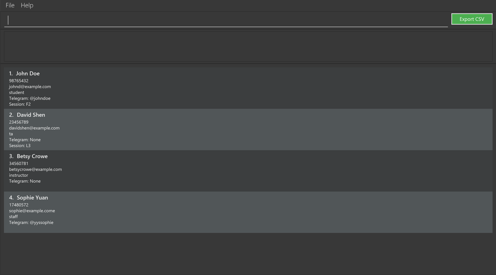

   - Command box: type commands here and press Enter.
   - Result display: shows feedback, errors, and summaries of actions.
   - Contact list: updates instantly based on your commands and filters.
   - Export CSV button: quickly export the currently displayed list.

### 4.4 Try the CLI

1. Type the command in the command box and press Enter to execute it. e.g. typing **`help`** and pressing Enter will open the help window. 
   Some example commands you can try:

   * `list` : Lists all contacts.

   * `add n:John Doe p:98765432 e:johnd@example.com t:student u:@johndoe s:F2` : Adds a student contact named `John Doe` to the contact list.

   * `delete 3` : Deletes the 3rd contact shown in the current list.

   * `clear` : Deletes all contacts.

   * `exit` : Exits the app.

1. Refer to the [Features](#features) below for details of each command.

--------------------------------------------------------------------------------------------------------------------

## 5. Features

**:information_source: Notes about the command format:** 

* Words in `UPPER_CASE` are the parameters to be supplied by the user. 
  e.g. in `add n:NAME`, `NAME` is a parameter which can be used as `add n:John Doe`.

* Items in square brackets are optional. 
  e.g `n:NAME [u:TELEGRAM_USERNAME]` can be used as `n:John Doe u:@JohnDoe` or as `n:John Doe`.

* Parameters can be in any order. 
  e.g. if the command specifies `n:NAME p:PHONE_NUMBER`, `p:PHONE_NUMBER n:NAME` is also acceptable.

* Extraneous parameters for commands that do not take in parameters (such as `help`, `list`, `export`, `undo`, `exit`, and `clear`) will be ignored. 
  e.g. if the command specifies `help 123`, it will be interpreted as `help`.

* If you are using a PDF version of this document, be careful when copying and pasting commands that span multiple lines as space characters surrounding line-breaks may be omitted when copied over to the application.

### 5.1 Viewing Help: `help`

Shows a message explaining how to access the help page.

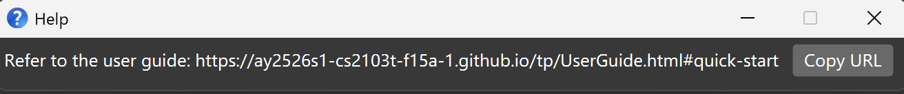

Format: `help`

Expected output: The Help window opens and remains visible until closed.

### 5.2 Adding a person: `add`

Adds a contact to the contact list of TAConnect.

Format: `add n:NAME p:PHONE_NUMBER e:EMAIL t:TYPE [u:TELEGRAM_USERNAME] [s:SESSION]`

Notes:
* `s:SESSION` must be provided when the Type is `student` or `ta`.
* `s:SESSION` must be omitted when the Type is `instructor` or `staff`.
* Trying to add a contact whose email matches an existing one (comparison is case-insensitive) will be rejected as a duplicate, even if the other fields like name differ.

For convenience, a TA can also record telegram username, but it is an optional field.

Expected output:
- The result display confirms the creation (e.g., "New person added: John Doe …").
- The new contact appears in the currently displayed list (unless a filter hides it).

Examples:
* Add contact type `student`: `add n:John Doe p:98765432 e:johnd@example.com t:student u:@johndoe s:F2` (session required)
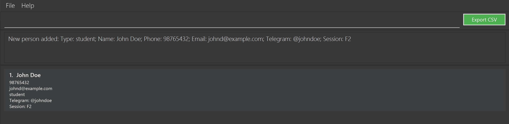
* Add contact type `ta`: `add n:David Shen p:23456789 e:davidshen@example.com t:ta s:L3`
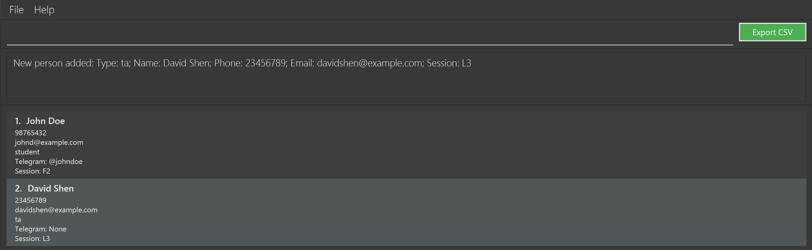
* Add contact type `instructor`: `add n:Betsy Crowe p:34560781 e:betsycrowe@example.com t:instructor` (session omitted)
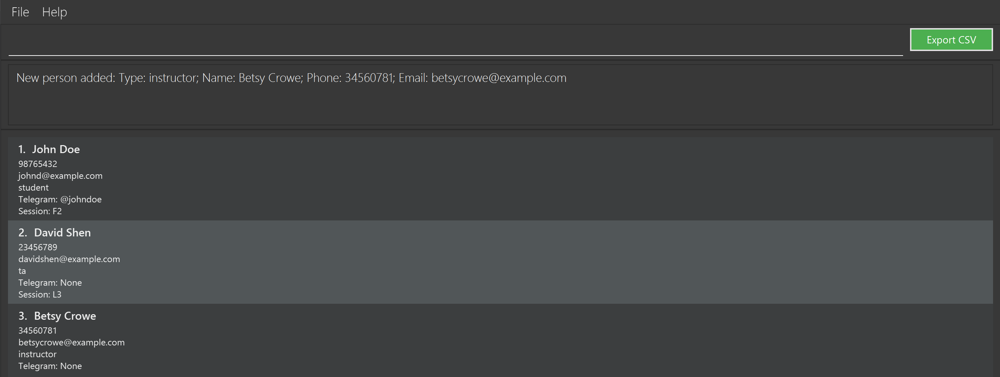
* Add contact type `staff`: `add n:Sophie Yuan p:17480572 e:sophie@example.come t:staff u:@yyssophie`
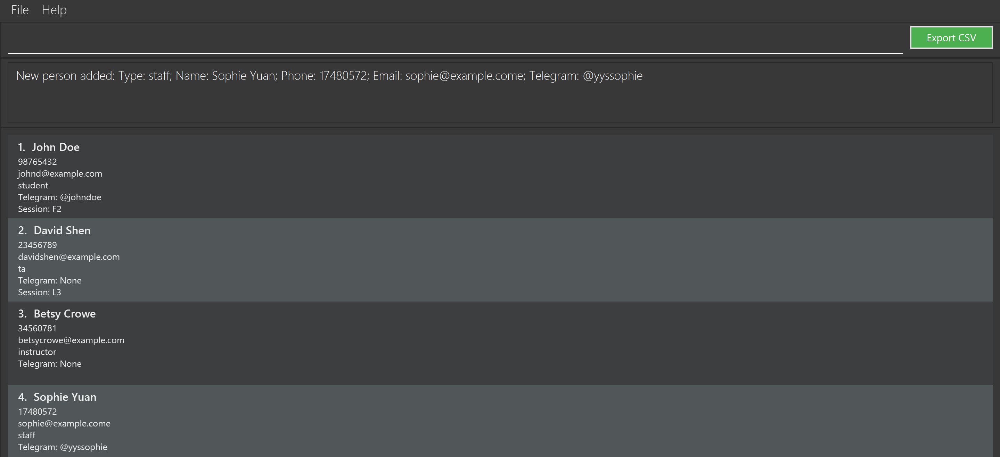

#### Field Constraints

- Name: Maximum of up to 500 characters. Allows ASCII letters only (a–z, A–Z; no digits), spaces ( ), apostrophes (straight `'` U+0027, left/right ‘ ’ U+2018/U+2019, modifier letter apostrophe ʼ U+02BC), hyphens (-), periods (.), and slashes (/). Examples: O'Connor, D’Angelo, Jean-Luc, J. P. Morgan, Rajesh S/O Raman.
- Phone: Singapore numbers only - exactly 8 digits (0–9). No spaces, symbols, or country codes in this field.
- Email: Must be of the form local-part@domain and adhere to:
  - one and only one '@', no spaces
  - total length ≤ 254; local-part ≤ 64; each domain label ≤ 63
  - local-part uses letters/digits with [._+-] as separators; cannot start/end with a separator; no consecutive dots
  - domain labels separated by '.', each starts/ends alphanumeric; hyphens are allowed inside non-final labels (e.g., `exa-mple.com`), but the final label (Top Level Domain, TLD) must be alphanumeric only (so `co-m` is invalid); final label ≥ 2 characters
  - the domain must include at least one '.' (e.g., example.com); single-label domains like "ro" or "localhost" are not accepted
  - domain is case-insensitive; stored in lowercase
  - an email uniquely identifies a person, so the contact list cannot have multiple contacts having the same email
- Type: 
  - Type must be one of the four inputs, **case-insensitive**: `student`, `ta`, `instructor`, and `staff`. eg. `StUdEnT` is allowed.
- Session:
  - Format: 1–2 uppercase letters, followed by a number from 1–99 (leading zero allowed for 1–9), and an optional trailing uppercase letter (e.g., `G1`, `F01`, `T07`, `BA03`, `T07B`).
  - Note that `G01` and `G1` are treated as **different sessions**. Users should consistently use one format (with or without leading zeros) to avoid confusion.
  - `student` and `ta` must have a session, while `instructor` and `staff` should not have any session
  - Limitation: Each user can have only one session. Multi‑session assignment is planned; see [Planned Enhancements](#planned-enhancements). 
- Telegram Username: Optional field, must adhere to:
  - 5 to 32 characters long
  - accepted characters: a-z, A-Z, 0-9 and underscores
  - optionally, include @ as the first character (if you omit it, TAConnect prefixes one automatically)
  - for more details, see the following: https://core.telegram.org/method/account.updateUsername#parameters

#### Data Limits

- Maximum contacts: 2500
- Maximum unique sessions: 250
- When either limit is reached, `add` will fail with a clear error message.
- Importing a JSON data file that exceeds these limits will be rejected on startup.

#### Duplicate contacts

- TAConnect allows only one contact per exact `EMAIL`. A duplicate is any new entry whose email matches an existing contact, compared **case-insensitively**.
- Differences in name, phone, type, Telegram username, session do not matter once the emails match; the command will be rejected as a duplicate.
- Emails that differ only by letter casing (e.g., `alice@example.com` vs `ALICE@example.com`) are treated as the same contact.

### 5.3 Listing all contacts : `list`

Displays all contacts currently stored in TAConnect.

Format: `list`

* The list is reset to the full view, clearing any filters applied by previous commands such as `find` or `listsession`.
* Useful when you want to return to the complete contact list after filtering.

Expected output: The contact list shows every entry and the result display confirms the action.

Examples:
* `list` — Displays all contacts in TAConnect.
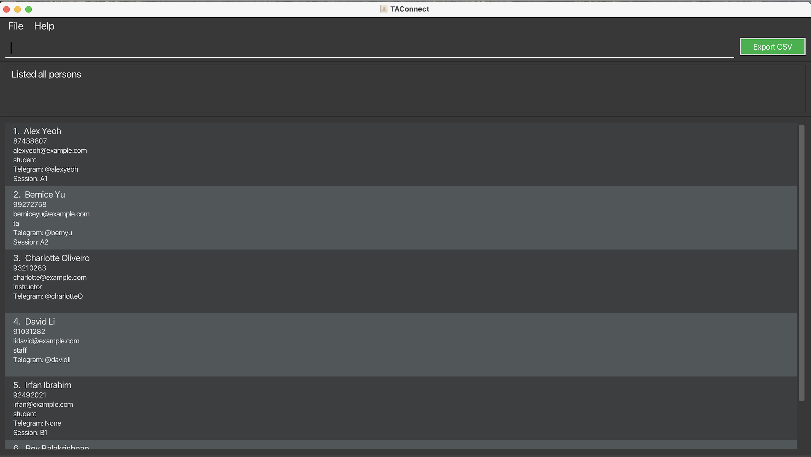

### 5.4 Listing all sessions : `sessions`

Shows all unique sessions currently recorded in TAConnect.

Format: `sessions`

* Displays the number of sessions and a list of the session codes in the result display.
* Useful for getting an overview of all existing tutorial/lab groups.

Examples:
* `sessions` — Lists all sessions, e.g., `12 sessions found in TAConnect. Here is the list: [F1, F2, G3, ...]`.
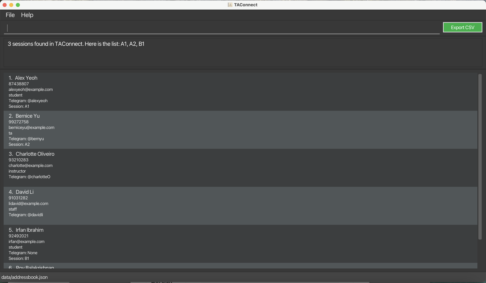

Expected output: The result display shows the number of sessions and their codes.

### 5.5 Listing contacts by session : `listsession`

Shows a list of all persons who belong to the specified session.

Format: `listsession SESSION`

* Displays only the contacts whose session field matches the given `SESSION` value.
* The session format follows the rules described in [Field Constraints](#field-constraints).
* Contacts without a session (e.g., instructors or staff) will not appear in the result.
* Useful for CS2040 TAs to filter to their assigned session.

Examples:
* `listsession F01` — Lists all contacts in session F01.
* `listsession T07B` — Lists all contacts in session T07B.
* `listsession A1` — Lists all contacts in session A1.
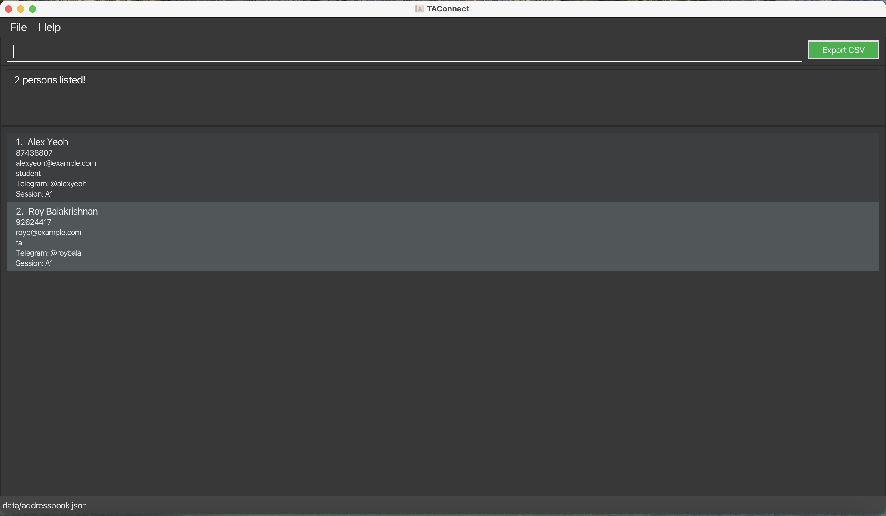

Expected output: The list shows only contacts in the specified session and the result display states how many were found.

Tip: Combine `listsession` with `export` to save a CSV for a specific tutorial group.

### 5.6 Locating Persons by Name: `find`

Finds persons whose names contain the given substring (case-insensitive).

Format: `find KEYWORD`

* Only the name is searched.
* The search is case-insensitive. e.g `hans` will match `Hans`.
* Partial matches are allowed. e.g. `Han` will match `Hans`.
* Whitespace inside `KEYWORD` is preserved; `find alex david` searches for the exact substring `"alex david"` (including the space).
* Allowed characters in `KEYWORD`: ASCII letters only (a–z, A–Z; no digits), spaces ( ), apostrophes ('), hyphens (-), periods (.), and slashes (/). Examples: `find O’Connor`, `find Jean-Luc`, `find Rajesh S/O`.

Examples:
* `find John` returns `john` and `John Doe`
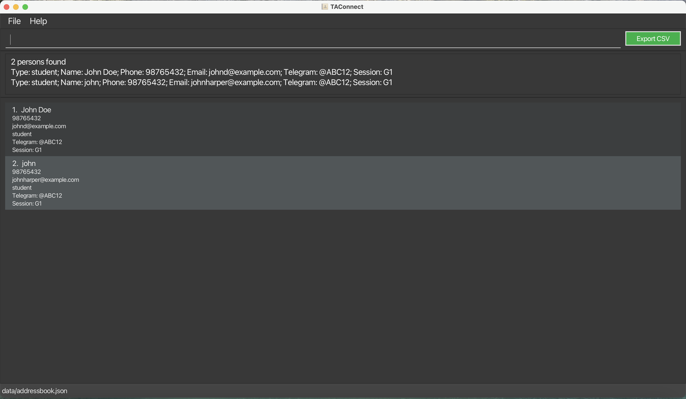
* `find alex` returns `Alex Yeoh`
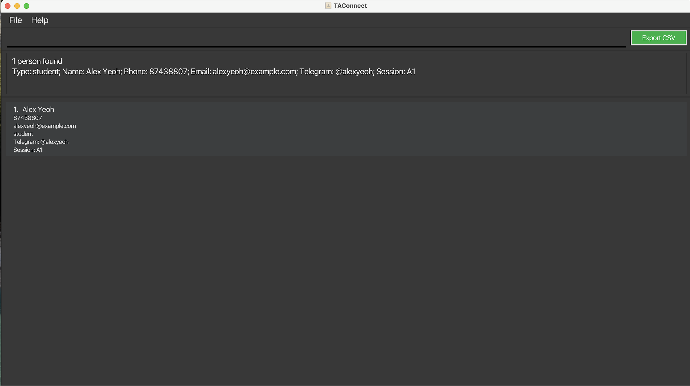

Expected output: The list filters to names containing the keyword (case-insensitive) and the result display shows the number of matches.

Tip: To search for a space or hyphenated surname, include the exact substring (e.g., `find Jean-Luc`, `find Alex Yeoh`).

### 5.7 Deleting a person : `delete`
Aliases: `del`, `rm`

Deletes the specified person from the contact list.

Format: `delete INDEX [MORE_INDEXES|RANGE] [n:NAME] [n:MORE_NAMES]`

* Deletes each person at the specified `INDEX` values, any indices in a `RANGE` of the form `A-B` (inclusive; A ≤ B),
  or with the exact `NAME` provided.
* The indexes refer to the numbers shown in the displayed person list.
* Every index **must be a positive integer** 1, 2, 3, …​
* Names are case-sensitive and must match the contact name exactly, including spaces.

Examples:
* `list` followed by `delete 2` deletes the 2nd person in the contact list.
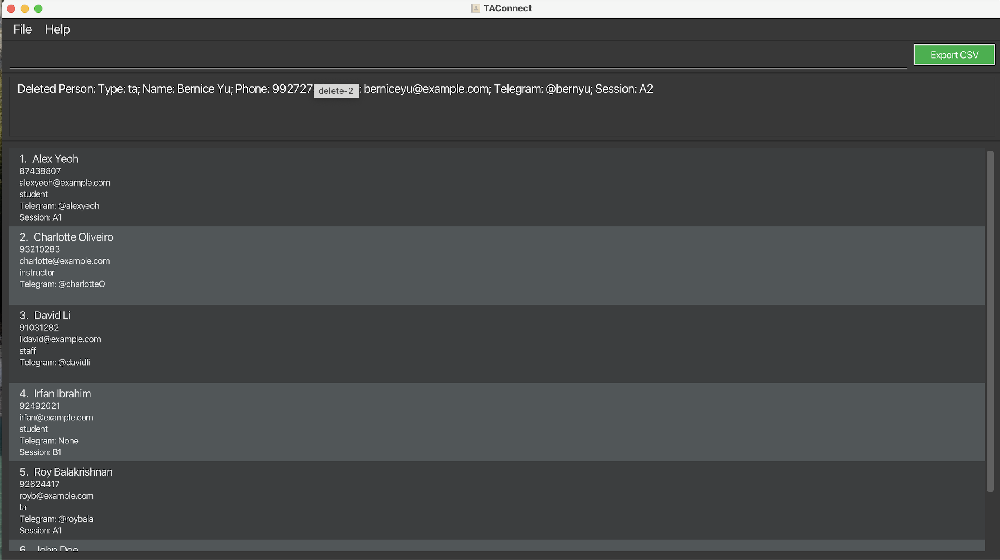
* `list` followed by `delete 1 3` deletes both the 1st and 3rd persons in the currently displayed list.
* `delete 2-5` deletes the 2nd to 5th persons shown in the current list (inclusive).
* `delete 1 3-4` deletes the 1st, 3rd, and 4th persons.
* `delete n:Alice Tan` deletes the contact whose name is exactly `Alice Tan`.
* `list` followed by `delete 1 n:Alice Tan` deletes the 1st person in the list and the contact named `Alice Tan`.
* `find Betsy` followed by `delete 1` deletes the 1st person in the results of the `find` command.
* Aliases: `del 2`, `rm n:Alice Tan` behave the same as `delete`.

**Caution:** Deleting is irreversible unless you use `undo` in the same session.

Expected output: The result display confirms which entries were deleted (by index or name).

Tip: Prefer selecting by `find` then deleting by index to avoid name typos.

### 5.8 Undo last change : `undo`

Undoes the most recent command that modified the contact list (e.g., `add`, `delete`, `clear`). History is kept only for the current session; closing the app clears the undo stack. The undo history stores up to 50 changes.

Format: `undo`

Examples:
* `add n:John Doe ...` followed by `undo` removes the newly added contact and shows `Undo successful (reverted: add)`.
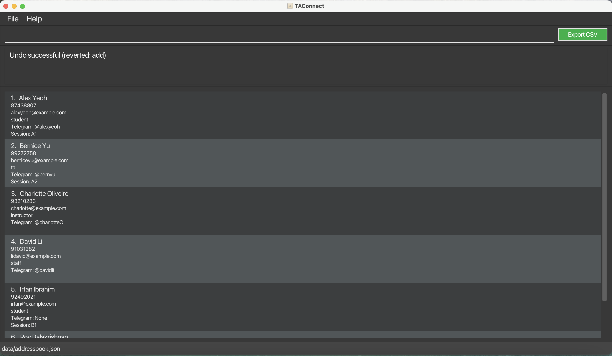
* `delete 1 3-4` followed by `undo` restores the contacts removed by that delete and reports the exact command alias that was reverted (e.g., `delete`, `del`).

Expected output: The result display confirms the revert and names the command that was undone.

### 5.9 Exporting the displayed contacts : `export`

Exports the contacts currently shown in the list to a CSV file containing `Name`, `Phone`, `Telegram`, `Email`, `Type`, and `Session`.

* Run `export` or click the `Export CSV` button located beside the command box.
* TAConnect saves the file as `exports/contacts-YYYYMMDD-HHmmss.csv`, using the timestamp of when you trigger the export.
* Only the contacts currently listed are exported. Combine with commands such as `find` to export a filtered subset before clicking the button.
* The result display shows the location of the generated file once the export completes, e.g., `Exported 12 contact(s) to /path/to/exports/contacts-20241027-153120.csv`.
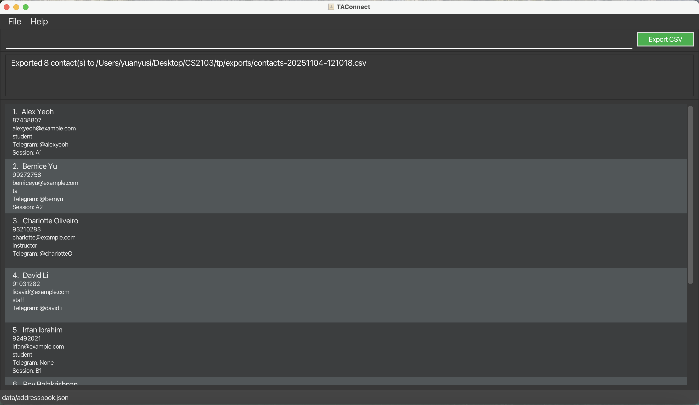

Why export:
- Share a filtered list with instructors or teammates.
- Upload to spreadsheets/LMS, or keep quick backups.

**Caution:** Ensure the application has write access to the `exports/` folder. If the folder is read-only or on a restricted path, the export may fail.

### 5.10 Clearing All Entries: `clear`

Clears all entries from the contact list of TAConnect.
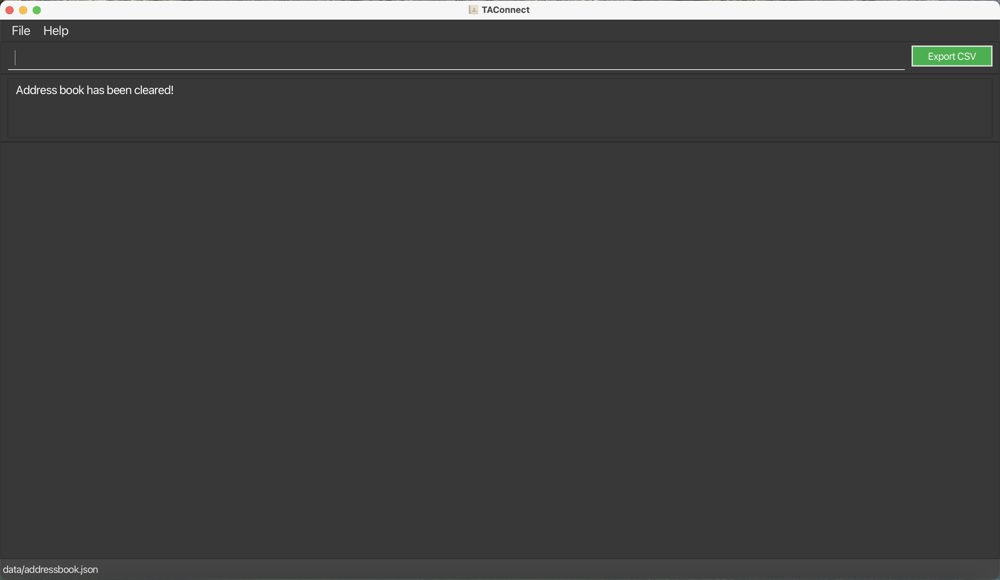

Format: `clear`

### 5.11 Exiting the Program: `exit`

Exits the program.

Format: `exit`

### 5.12 Saving the Data

TAConnect data are saved in the hard disk automatically after any command that changes the data. There is no need to save manually.

### 5.13 Editing the Data File

TAConnect data are saved automatically as a JSON file `[JAR file location]/data/taconnect.json`. Advanced users are welcome to update data directly by editing that data file.

**Caution:** If your changes to the data file makes its format invalid, TAConnect will discard all data and start with an empty data file at the next run. Hence, it is recommended to take a backup of the file before editing it. 
Furthermore, certain edits can cause the TAConnect to behave in unexpected ways (e.g., if a value entered is outside of the acceptable range). Therefore, edit the data file only if you are confident that you can update it correctly.

### 5.14 Navigate Command History (↑/↓)

TAConnect remembers all previously entered commands within the current session.  

You can move through them using the **Up (↑)** and **Down (↓)** arrow keys, similar to a terminal.
#### Key summary

| Key | Action |
|------|--------|
| **↑ Up Arrow** | Recall previous command |
| **↓ Down Arrow** | Move to next newer command or back to draft |

#### Navigation

* **↑ (Up):** Moves to the previous command (older).
* **↓ (Down):** Moves toward newer commands, and finally returns to the **latest position**, which restores your unfinished input (draft).

At any time:
- The top of history (oldest command) stops navigation.
- The **latest position** represents an empty command box (your working input area).

#### Draft restoration

- When you start navigating history, TAConnect saves your current text as a **draft**.
- Navigating back **Down** to the latest position restores this draft exactly as before.
- Edits made while viewing a recalled command do **not** overwrite the draft.
- Once you return to the latest position, you can continue editing normally.

#### Recording rules

- Every non-blank command you execute (press **Enter**) is added to history, even if it fails to run (e.g., invalid syntax).
- Empty or whitespace-only inputs are not recorded.
- History is stored **in memory only** and clears when the app restarts.

#### Example

1. Type `list` → press **Enter**.
2. Type `find alex` → press **Enter**.
3. Type `li` (editing draft).
4. Press **↑** once → shows `find alex`.
5. Press **↑** again → shows `list`.
6. Press **↓** twice → your edited `li` reappears.
7. Type `st` so `li` becomes `list` (editing draft).
8. Press **↑**, then **↓** → your edited `list` reappears.

#### Using recalled commands

You can directly run a recalled command or modify it before executing:

1. Press **↑** to recall a previous command (e.g., `find alex`).
2. Edit it (e.g., change to `find david`).
3. Press **Enter** to execute the edited command.

TAConnect treats the edited command as a new entry in history.  
This feature helps TAs quickly repeat or adjust similar commands (e.g., running `find` for multiple names or repeating `listsession` for different groups) without retyping from scratch.

**Tip:** Use ↑/↓ to quickly reuse or correct past commands instead of retyping them.

--------------------------------------------------------------------------------------------------------------------

## 6. FAQ

**Q**: How do I transfer my data to another Computer? 
**A**: Install the app in the other computer and overwrite the empty data file it creates with the file that contains the data of your previous TAConnect home folder.

--------------------------------------------------------------------------------------------------------------------

## 7. Known Issues

1. **When using multiple screens**, if you move the application to a secondary screen, and later switch to using only the primary screen, the GUI will open off-screen. The remedy is to delete the `preferences.json` file created by the application before running the application again.
2. **If you minimize the Help Window** and then run the `help` command (or use the `Help` menu, or the keyboard shortcut `F1`) again, the original Help Window will remain minimized, and no new Help Window will appear. The remedy is to manually restore the minimized Help Window.

--------------------------------------------------------------------------------------------------------------------

## 8. Command Summary

Action | Format, Examples
--------|------------------
**Add student** | `add n:NAME p:PHONE_NUMBER e:EMAIL t:student [u:TELEGRAM_USERNAME] s:SESSION`   e.g., `add n:John Doe p:98765432 e:johnd@example.com t:student u:@johndoe s:F2`
**Add ta** | `add n:NAME p:PHONE_NUMBER e:EMAIL t:ta [u:TELEGRAM_USERNAME] s:SESSION`   e.g., `add n:David Shen p:23456789 e:davidshen@example.com t:ta s:L3`
**Add instructor** | `add n:NAME p:PHONE_NUMBER e:EMAIL t:instructor [u:TELEGRAM_USERNAME]`   e.g., `add n:Betsy Crowe p:34560781 e:betsycrowe@example.com t:instructor`
**Add staff** | `add n:NAME p:PHONE_NUMBER e:EMAIL t:staff [u:TELEGRAM_USERNAME]`   e.g., `add n:Sophie Yuan p:17480572 e:sophie@example.come t:staff u:@yyssophie`
**Clear** | `clear`
**Delete** | `delete\|del\|rm INDEX [MORE_INDEXES\|RANGE] [n:NAME] [n:MORE_NAMES]`  e.g., `delete 3`, `del 1 4`, `rm 2-4`, `delete n:Alice Tan`
**Find** | `find KEYWORD`  e.g., `find James Jake`
**List** | `list`
**List session** | `listsession SESSION`   e.g., `listsession F20`
**Sessions** | `sessions`
**Undo** | `undo`
**Export CSV** | `export` or click the `Export CSV` button (saves to `exports/contacts-YYYYMMDD-HHmmss.csv`)
**Help** | `help`
**Exit** | `exit`

--------------------------------------------------------------------------------------------------------------------

## 9. Planned Enhancements

### 9.1 Multi‑session assignment for TAs
- What: Allow a user to be associated with multiple sessions (e.g., `s:F1 s:F2`) or store a list of sessions.
- Why: Many TAs can teach more than one session. Similarly a user can exist in multiple sessions: one session for lab group and one session for tutorial group.
- Status: Planned for a future release.

### 9.2 Role‑based listing: `listrole`
- What: List people by role (e.g., `student`, `ta`, `instructor`, `staff`).
- Why: Quickly find and contact specific groups, (e.g. contacting instructor)
- Status: Planned for a future release.

### 9.3 Edit the contact: `edit`
- What: Edit the field of one contact according to the index.
- Why: If the user enters wrong information of a contact, he/she can edit the incorrect field, instead of deleting the wrong contact and then adding it again.
- Status: Planned for a future release.

--------------------------------------------------------------------------------------------------------------------

## 10. Glossary
- TA: Teaching Assistant.
- Session: Group code for a tutorial/lab (e.g., `F1`, `G2`, `T10`).
- Telegram username: Optional contact handle (5–32 chars; letters, digits, underscores; may start with `@`).
- TLD (Top‑Level Domain): The last label in a domain (e.g., `.com`, `.sg`, `.edu`). Must be ≥ 2 characters in this app.
